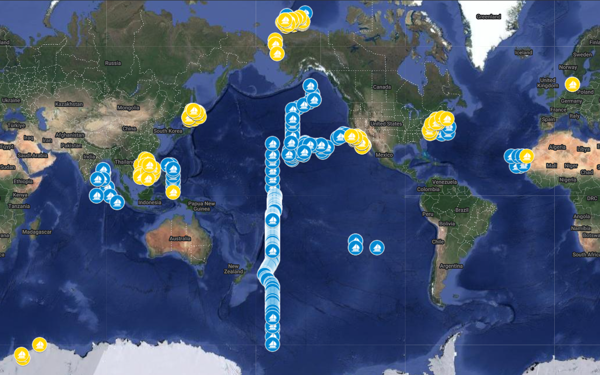

# Workflow for processing _nifH_ amplicon data sets

This repository contains all post-pipeline software stages and data deliverables described in Morando, Magasin et al. 2023.  The workflow was used to process nearly all published _nifH_ amplicon MiSeq data sets that existed at the time of publication, as well as some new data sets produced by the [Zehr Lab](https://www.jzehrlab.com/) at [UC Santa Cruz](https://www.ucsc.edu/). The samples are shown in this map which links to an interactive Google map with study names, sample IDs, and collection information for each sample.
[](https://www.google.com/maps/d/embed?mid=1M8ZCYmVIuLwEC-o1Ux_6m--uxgBIu_Q&ehbc=2E312F)


## Workflow overview

The following figure shows the workflow:

[DADA2](https://benjjneb.github.io/dada2/) ASVs were created by our [DADA2 _nifH_ pipeline](https://github.com/jdmagasin/nifH_amplicons_DADA2) (green). Post-pipeline stages (lavender), each executed by a Makefile, were used to gather the ASVs from all studies, filter the ASVs for quality, and annotate them.  The two main data resources generated by the workflow, the _nifH_ ASV database and the _nifH_ ASV catalog, will support future research into N<sub>2</sub>-fixing marine microbes.  They are also available at [10.6084/m9.figshare.23795943](10.6084/m9.figshare.23795943).


## Running the workflow

The workflow requires the [DADA2 _nifH_ pipeline](https://github.com/jdmagasin/nifH_amplicons_DADA2) as well as its ancillary tools.  Please see the Installation directory in the pipeline repository.  Additionally you will need to install GNU make to run the post-pipeline stages, each of which uses a Makefile.  Please see the [Installation instructions](Installation/INSTALL.txt).

The DADA2 _nifH_ pipeline outputs for all studies are provided in the Data directory.  You do not need to run the pipeline.  However, if you wish to run the pipeline, the parameters files used for each study are included in Data.  You are free to modify them.

Each of the post-pipeline stages 1 through 6 can be run -- in order -- by entering the associated directory and running "make" from your shell's command line.  For example, if I wanted to run the GatherAsvs stage I would do the following from the command line:

```bash session
(base) [jmagasin@thalassa]$ conda activate DADA2_nifH
(DADA2_nifH) [jmagasin@thalassa]$ conda activate --stack nifH_ASV_workflow
(nifH_ASV_workflow) [jmagasin@thalassa]$ cd GatherAsvs
(nifH_ASV_workflow) [jmagasin@thalassa]$ make &> log.18July2023.txt &
```

Here I am using a BASH shell (recommended).  It is critical that both the DADA2_nifH and nifH_ASV_workflow environments were activated sometime before running the stage.  The most recently activated environment is shown in parentheses at the start of the prompt.  On the fourth line, I make the GatherAsvs stage and save the Makefile messages to a log file.  Most stages take at least a few minutes to complete so I run them in the background (the trailing &).

Please see documentation at the top of each Makefile for an overview of the stage.


***
_Copyright (C) 2023 Michael B. Morando and Jonathan D. Magasin_
