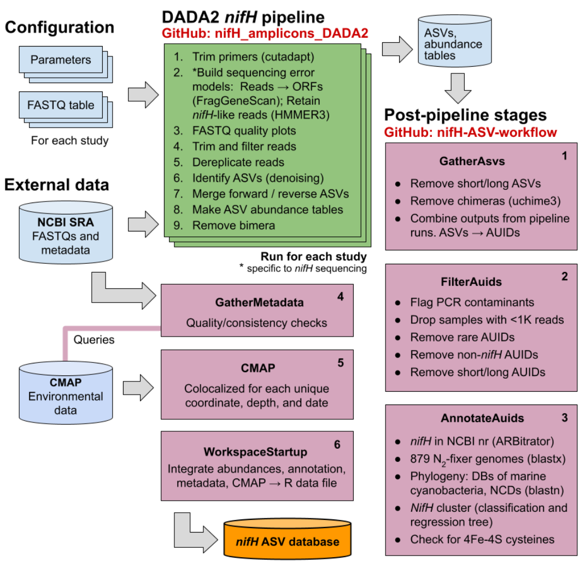

# Workflow for processing _nifH_ amplicon data sets

This repository contains all post-pipeline software stages and data deliverables described in Morando, Magasin et al. 2023.  The workflow was used to process nearly all published _nifH_ amplicon MiSeq data sets that existed at the time of publication, as well as some new data sets produced by the [Zehr Lab](https://www.jzehrlab.com/) at [UC Santa Cruz](https://www.ucsc.edu/). The samples are shown in this map which links to an interactive Google map with study names, sample IDs, and collection information for each sample.

## Workflow overview
The following figure shows the workflow:

[DADA2](https://benjjneb.github.io/dada2/) ASVs were created by our [DADA2 _nifH_ pipeline](https://github.com/jdmagasin/nifH_amplicons_DADA2) (green). Post-pipeline stages (orange), each executed by a Makefile, were used to gather the ASVs from all studies, filter the ASVs for quality, and annotate them.  The two main data resources generated by the workflow, the _nifH_ ASV database and the _nifH_ ASV catalog, will support future research in to nitrogen-fixing marine microbes.
